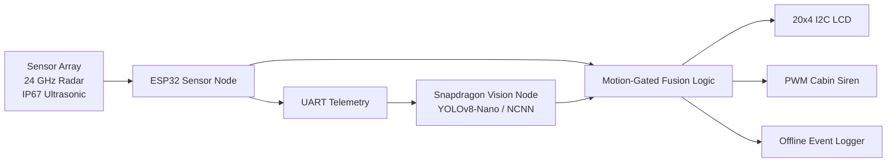

# 🛡️ NEURO-PATH

## Zero-Cloud ADAS for Safer Mine Vehicles

[](https://www.sih.gov.in/)
[](#team)
[](#technology-stack)

**Smart India Hackathon 2026**

| Field | Details |
|---|---|
| Problem Statement | **SIH26007** |
| Theme | Safe and Efficient Operation of Mine Vehicles in Fog and Low-Visibility Conditions in Open Cast Iron Ore Mines |
| Ministry | Ministry of Steel |
| Implementation Context | NMDC Bailadila |
| Team | **THYNK UNIQUE** |
| Team Lead | **Subhan Khan** |

---

## 🔎 Overview

Open-cast iron ore mines experience monsoon fog, dust, and visibility conditions as low as 3–5 metres. Conventional optical systems can lose reliability, while static obstacles such as quarry walls may produce repeated nuisance alarms that contribute to operator sensory fatigue.

NEURO-PATH is a zero-cloud Advanced Driver Assistance System for heavy mine vehicles. It combines 24 GHz mmWave radar, IP67 ultrasonic sensing, edge vision, and motion-gated decision logic to provide reliable blind-spot and proximity alerts without depending on cellular connectivity or cloud processing.

The system is designed as a retrofit safety layer for legacy mining fleets, with local telemetry, operator feedback, and offline operation.

**📖 For full mathematical models, sensor physics, and deployment roadmaps, please read our [Detailed Project Report](NEURO_PATH_Detailed_Project_Report.md).**

> Prototype performance figures and nuisance-alarm reduction targets must be validated through controlled field testing before production or safety-critical deployment.

## ✨ Key Features

### 🚦 Motion-Gated Alert Logic

The system evaluates object distance, relative motion, vehicle state, and spatial position before triggering an alarm. This helps reduce repeated warnings caused by static quarry walls and persistent background objects.

### 🌫️ Weather-Immune RF and Acoustic Sensing

The sensing layer combines 24 GHz mmWave radar for motion and proximity detection with IP67 ultrasonic sensors for short-range distance measurement. Vision assistance adds object classification and situational context.

### ☁️ Zero-Cloud Edge Processing

Core detection and alert decisions are processed locally on the vehicle using ESP32 sensor-node processing, Snapdragon-based vision processing, UART/I2C telemetry, and offline event logging. Continuous cloud connectivity is not required for core alerts.

### 🔊 Operator-Centred Alerting

Threats are communicated through a PWM cabin siren, spatial acoustic cues, a 20x4 I2C LCD, and local distance/zone status.

## 🧩 System Architecture

The system follows a three-tier flow:



### Three-Tier Hardware Flow

1. **Sensor Array** — Radar and ultrasonic sensors monitor blind zones, proximity, and object movement around the vehicle.
2. **ESP32 Sensor Node** — The ESP32 collects sensor readings, performs deterministic edge processing, applies motion-gated logic, and communicates through UART and I2C.
3. **Vision and Operator Interface** — The Snapdragon-based vision node provides optional YOLOv8-Nano classification using NCNN. The LCD and cabin siren provide immediate feedback.

## 🧰 Technology Stack

### Hardware

- ESP32-WROOM-32 sensor node
- ESP32-CAM / OV2640 video transmitter where applicable
- HLK-LD2410C 24 GHz mmWave radar
- A02YYUW IP67 ultrasonic sensor array
- Poco F1 or Snapdragon-based vision node
- Snapdragon 845/855 processing platform
- 20x4 I2C LCD display
- PWM cabin siren
- UART telemetry and I2C interfaces

### Software

- Bare-metal C++ / Arduino firmware for ESP32
- FreeRTOS
- Python 3.10+
- OpenCV
- Ultralytics YOLOv8-Nano
- NCNN inference runtime
- UART serial communication
- I2C communication
- Offline telemetry and event logging

## 📁 Repository Structure

```text
.
├── ESP32_CAM_Vision_Transmitter.ino
├── Primary_Sensory_Fusion.ino
├── Secondary_Vision_Module.py
├── requirements.txt
├── LICENSE
└── README.md
```

## ⚙️ Setup and Installation

### ESP32 Firmware

Install the ESP32 board package in Arduino IDE, select the correct board, connect the sensor node, and flash the relevant sketch.

```bash
arduino-cli compile --fqbn esp32:esp32:esp32 Primary_Sensory_Fusion.ino
arduino-cli upload -p <ESP32_PORT> --fqbn esp32:esp32:esp32 Primary_Sensory_Fusion.ino
```

Replace `<ESP32_PORT>` with a port such as `COM5` or `/dev/ttyUSB0`. The ESP32-CAM transmitter sketch can be compiled and uploaded similarly after selecting the appropriate camera board profile.

### Vision Node

```bash
python -m venv .venv
```

Windows:

```powershell
.venv\Scripts\activate
```

Linux/macOS:

```bash
source .venv/bin/activate
```

```bash
pip install -r requirements.txt
python Secondary_Vision_Module.py
```

The exact camera source, model path, serial port, and Snapdragon runtime configuration may vary by deployment.

## 🔌 Communication Interfaces

### UART

Used for telemetry between the ESP32 sensor node and the vision node. A representative record is:

```text
timestamp, sensor_id, distance_cm, motion_state, zone_id, alert_state
```

### I2C

Used for the 20x4 LCD display, compatible sensor peripherals, and local diagnostic interfaces.

## 🧪 Safety and Validation

Before deployment on operating mining vehicles, the prototype should undergo sensor calibration, weather and dust-condition testing, false-positive/false-negative analysis, detection-range validation, electromagnetic compatibility testing, human-factors testing, vehicle integration testing, and independent safety review.

This repository does not claim certification for autonomous control, emergency braking, or safety-critical vehicle operation.

## 👥 Team

**THYNK UNIQUE**

- **Team Lead:** Subhan Khan
- **Project:** NEURO-PATH
- **SIH Problem Statement:** SIH26007

## ⚠️ Safety & Liability Disclaimer

This project was developed as an experimental prototype for the Smart India Hackathon 2026 and is not a certified production safety system. NEURO-PATH is an experimental Advanced Driver Assistance System (ADAS); the creators assume no liability for hardware failures, and it must not replace certified OEM safety systems in active mining environments without official DGMS and ISO compliance testing.

## 📄 License

This project is released under the [MIT License](LICENSE).

The MIT License permits use, modification, and distribution subject to the conditions included in the accompanying LICENSE file.

## ⚠️ Disclaimer

NEURO-PATH is an experimental research and engineering prototype. It must not be used as the sole safety system for mining vehicles, personnel protection, emergency response, or operational decision-making without appropriate validation, certification, redundancy, and approval from qualified safety authorities.

The project team makes no guarantee that the prototype will detect every obstacle or prevent every incident in all environmental and operating conditions.
